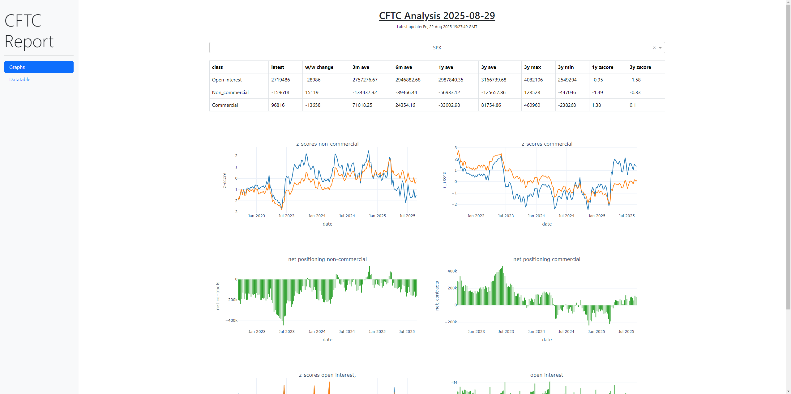

[](LICENSE)

# CFTC‑COT Dashboard

A Dash/Plotly web app that **downloads, processes, and visualizes the CFTC’s Commitments of Traders (COT)** data for fast positioning insight across major macro assets.

<p align="center">
  
</p>
---

## What

This project fetches the CFTC **disaggregated** historical ZIP archives, keeps them up‑to‑date, parses the weekly Excel files, and serves an interactive dashboard with two main views:

- **Graphs** – positioning and open‑interest time series (Commercial vs. Non‑Commercial) with rolling stats and z‑scores.
- **Data Table** – a compact summary with week‑over‑week deltas, multi‑horizon averages, and 3‑year bands to spot extremes quickly.

Under the hood, an ingestion service checks the CFTC site on a schedule, only downloads truly new ZIPs (via `Last-Modified`), extracts files by year, and records state in SQLite so subsequent runs are fast and idempotent.

---

## Why

- **Spot extremes fast.** Z‑scores (1‑year & 3‑year) make statistically unusual positioning pop out.
- **Separate “who” from “what.”** View **Commercial** vs **Non‑Commercial** behavior and open interest side‑by‑side.
- **Hands‑off ingestion.** Automatic hourly checks for new CFTC ZIPs; new years trigger an optional **email notification**.
- **Reproducible + portable.** Python 3.10 project with a Dockerfile and a pinned `requirements.txt` for consistent deployment.

---

## Features

- **Automated data pipeline**
  - Checks `Last-Modified` for yearly archives (2020–2025 by default).
  - Downloads to `data/xls_data/`, processes to `data/cftc_data/`, and tracks state in `data/cftc_data.db` (SQLite).
  - Optional **SMTP/Gmail** email on updates (set `EMAIL_USER`, `EMAIL_PASSWORD`).

- **Analytics**
  - **Z‑scores:** 1‑year and 3‑year for quick regime context.
  - **Averages:** 3m / 6m / 1y / 3y rolling means.
  - **Extremes:** 3‑year min / max bands; week‑over‑week deltas.

- **Dashboard UX**
  - **Two pages:** “Graphs” and “Data Table,” accessible via navbar.
  - **Daily header**: “CFTC Analysis YYYY‑MM‑DD” auto‑updates at local midnight (CET).
  - **“Last update” banner** shows the most recent ingestion timestamp.
  - Built with Dash, Plotly, and Dash Bootstrap Components.

- **Operations**
  - **Main entrypoint:** `main.py` ensures data exists (on boot), then starts the Dash server.
  - **Background worker:** hourly ZIP re‑check runs in a separate process.
  - **Debug utility:** `remove_last_entry.py` to trim the most recent DB row when testing.

> Key modules: `zip_checker.py` (downloader + email + DB), `cftc_analyser.py` (metrics & tables), `app_cftc.py` (Dash app), `main.py` (orchestration).

---

## Getting Started

### Prerequisites
- Python **3.10+** (project tested on 3.10)
- `pip` (latest)
- (Optional) Gmail SMTP **App Password** if you want email notifications

### 1) Clone & create a virtual environment
```bash
git clone https://github.com/<your-user>/CFTC-COT-Report.git
cd CFTC-COT-Report

python -m venv venv
# Windows (Git Bash / PowerShell)
source venv/Scripts/activate
# macOS / Linux
# source venv/bin/activate
```

### 2) Install dependencies
```bash
pip install --upgrade pip
pip install -r requirements.txt
```

### 3) (Optional) Configure email notifications
Set the following environment variables (use a Gmail **App Password**):
```bash
# Windows (Git Bash)
export EMAIL_USER="you@gmail.com"
export EMAIL_PASSWORD="your-app-password"

# PowerShell
$env:EMAIL_USER="you@gmail.com"
$env:EMAIL_PASSWORD="your-app-password"
```

### 4) Run locally
```bash
python main.py
```
Now open your browser at: **http://127.0.0.1:5000/**

> First launch will download and process the required yearly ZIPs. Subsequent starts will be much faster.

---

## Docker (optional)

A minimal image is provided.

```bash
# Build
docker build -t cftc-app .

# Run (map the web port and persist data to a host folder)
docker run --rm -p 5000:5000 -e EMAIL_USER="you@gmail.com" -e EMAIL_PASSWORD="app-password"   -v "$PWD/data:/app/data" cftc-app
```

**Note:** The default Dockerfile `CMD` expects `src/main.py`. If your repo keeps `main.py` at the root, change the last line to:
```dockerfile
CMD ["python", "main.py"]
```
or place your `main.py` in `src/` accordingly.

---

## Configuration & Data Layout

```
data/
  xls_data/         # extracted CFTC Excel files by year
  cftc_data/        # processed/normalized outputs (created as needed)
  cftc_data.db      # SQLite DB tracking yearly ZIP Last-Modified values
res/
  metrics.yaml      # metric configuration per asset class (required by analyser)
```

- If `res/metrics.yaml` is missing, create it with your asset‑class metric map. Example snippet:
```yaml
Futures:
  - non_comm_net
  - non_comm_long
  - non_comm_short
  - comm_net
  - open_interest
```

---

## Roadmap

- [ ] Package **metrics** as a first‑class config with presets per asset class.
- [ ] Add in‑app **alerts** (e.g., z‑score thresholds) and a lightweight “signals” page.
- [ ] Improve **Docker** image (non‑root, slimmer base, healthcheck) and fix default `CMD`.
- [ ] Swap SMTP emails for in‑app toasts + webhook integrations (Slack/Discord).
- [ ] Add **unit tests** (ETL & metrics) and **GitHub Actions** CI.
- [ ] Expose a JSON **/api** for programmatic access to processed metrics.
- [ ] Add more **visuals** (e.g., scatter of W/W vs Z‑score, regime heatmaps).
- [ ] Parameterize **years** and add automatic backfill for new years.

---

## License
This project is licensed under the **MIT License** — see [LICENSE](LICENSE) for details.
